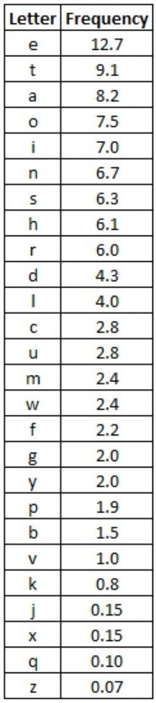

# Caesar Cipher

* CaesarCipher program that encrypts texts files with a given key.
* CaesarBreaker program that does frequency analysis attack on cipher text to find the key and decipher the text.

## CaesarCipher

The Caesar Cipher is one of the oldest and simplest forms of encrypting a message. It is a type of substitution cipher where each letter in the original message is replaced with a letter corresponding to a certain number of letters shifted up or down in the alphabet. For each letter of the alphabet, you would take its position in the alphabet, say 3 for the letter 'C', and shift it by the key number. If we had a key of +3, that 'C' would be shifted down to an 'F' - and that same process would be applied to every letter in the plaintext. 

  

Plaintext: THE QUICK BROWN FOX JUMPS OVER THE LAZY DOG

Ciphertext: QEB NRFZH YOLTK CLU GRJMP LSBO QEB IXWV ALD 

## Frequency analysis

Frequency analysis is based on the study of the frequency of letters or groups of letters in a ciphertext. In all languages, different letters are used with different frequencies. For each language proportions of appearance of all characters are slightly different, so texts written in a given language have some certain common properties, which allow to distinguish them from texts written in other languages. In English, E is the most commonly used letter; therefore, in a sufficiently large sample of English text, it is likely that the letter that appears the most frequently in the text will be the letter E. 

  

We can use this property of language to break not just Caesar cipher but any shift cipher. Using the following steps, the plaintext can be retrieved:

1. Identify the most common letter in the ciphertext.

2. Determine the shift used to make this letter decrypt to an E. For example, E is the fifth letter in the alphabet and, if J is the most common letter and is the tenth letter in the alphabet, the shift used is five.
3. Decrypt the plaintext using the calculated shift value.

*****
* Made as a part of the Coursera course: ['Java Programming: Arrays, Lists, and Structured Data'](https://www.coursera.org/learn/java-programming-arrays-lists-data).
* Developed in BlueJ Environment.
* [FileResources Documentation](https://ant.apache.org/manual/api/org/apache/tools/ant/types/resources/FileResource.html)  